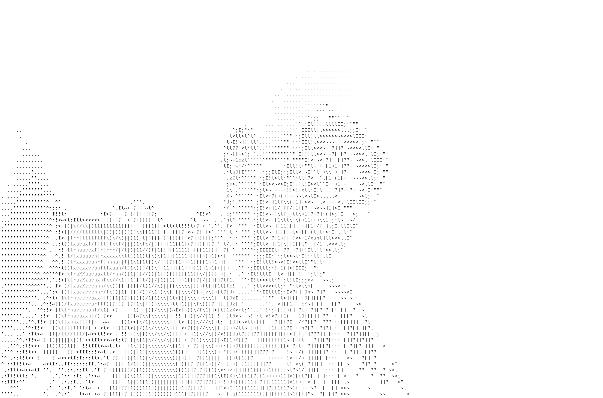

<p align="center">
  
</p>

<h1 align="center">Hi 👋, I'm Hudeifa Mohamud Jangale</h1>

<p align="center">
  <code>hudeifa@jangale:~$ whoami</code>
</p>

<h3 align="center">
  Full-Stack Software Engineer • Creative Tech Builder • Digital Creator
</h3>

<p align="center">
  Building modern, scalable, and meaningful digital experiences.
</p>

<p align="center">
  
</p>

<p align="center">
  <a href="https://github.com/Hudiefa-Janna-Gale">
    
  </a>
  <a href="mailto:hudeifa609@gmail.com">
    
  </a>
  <a href="https://www.dhigaalplatform.com/stories">
    
  </a>
</p>

<p align="center">
  
</p>

---

## 👨‍💻 About Me

I’m **Hudeifa Mohamud Jangale**, a **Full-Stack Software Engineer** and creative digital builder passionate about turning ideas into modern, scalable, and user-friendly digital products.

My development work spans both **frontend and backend engineering**. I enjoy designing responsive interfaces, building robust APIs, working with databases, and connecting different parts of an application into complete production-ready systems.

I work primarily with technologies such as **React, Next.js, JavaScript, Node.js, PostgreSQL, MongoDB, Docker, and REST APIs**, while continuously expanding my knowledge across software engineering and modern web development.

Beyond software engineering, I’m also passionate about **video editing, camera work, drone content, motion, and visual storytelling**. I enjoy combining technology and creativity to build experiences that are not only functional but also visually meaningful.

---

## 🧑‍💻 Software Engineering

```text
Frontend Engineering : React.js, Next.js, JavaScript, Redux
Backend Engineering  : Node.js, REST APIs, Server-side Development
Databases             : PostgreSQL, MongoDB
DevOps & Tools        : Docker, Git, GitHub, Postman
UI / UX               : Responsive Design, Figma, Modern UI
Creative Technology   : Video Editing, Camera, Drone, Visual Storytelling
```

---

## 🚀 What I’m Focused On

* 🔭 Currently working on **E-Learning Platform**
* 💻 Building **full-stack web applications**
* 🎨 Creating clean, responsive, and modern user interfaces
* ⚙️ Developing backend services, APIs, and database-driven applications
* 🗄️ Working with **PostgreSQL and MongoDB**
* 🐳 Learning and applying **Docker and modern deployment workflows**
* 🌱 Continuously improving my **software engineering and system design** skills
* 🎬 Exploring **video editing, visual storytelling, camera work, and drone creativity**
* 🌐 Creator of [Dhigaal Platform](https://www.dhigaalplatform.com/stories)
* 📫 Reach me at **[hudeifa609@gmail.com](mailto:hudeifa609@gmail.com)**

---

## 🛠️ Tech Stack

<p align="center">
  
</p>

<p align="center">
  
</p>

<p align="center">
  
</p>

---

## 💼 What I Build

### 🌐 Full-Stack Web Applications

Building complete web applications from **frontend interfaces to backend services, APIs, databases, and deployment**.

### 🎨 Frontend Development

Creating responsive and accessible interfaces with **React.js, Next.js, JavaScript, Tailwind CSS, Bootstrap, and modern UI principles**.

### ⚙️ Backend Development

Building backend systems and REST APIs using **Node.js**, with a focus on clean architecture, authentication, business logic, and reliable data management.

### 🗄️ Database Development

Working with relational and NoSQL databases including **PostgreSQL and MongoDB**, designing data structures and integrating them into applications.

### 🐳 DevOps & Deployment

Using **Docker, Git, GitHub, and modern deployment workflows** to develop, test, and deploy applications efficiently.

### 🎥 Creative Digital Production

Combining software and creativity through **video editing, camera production, drone visuals, and visual storytelling**.

---

## 🌍 Connect With Me

<p align="center">
  <a href="mailto:hudeifa609@gmail.com">
    
  </a>

  <a href="https://github.com/Hudiefa-Janna-Gale">
    
  </a>

  <a href="https://www.dhigaalplatform.com/stories">
    
  </a>
</p>

---

## ⚡ Engineering Mindset

```text
Think → Design → Build → Test → Improve → Ship

Code with purpose.
Build with creativity.
Learn continuously.
```

---

<p align="center">
  <b>Building software. Creating experiences. Telling stories.</b>
</p>

<p align="center">
  <code>hudeifa@jangale:~$ git push origin main</code>
</p>
